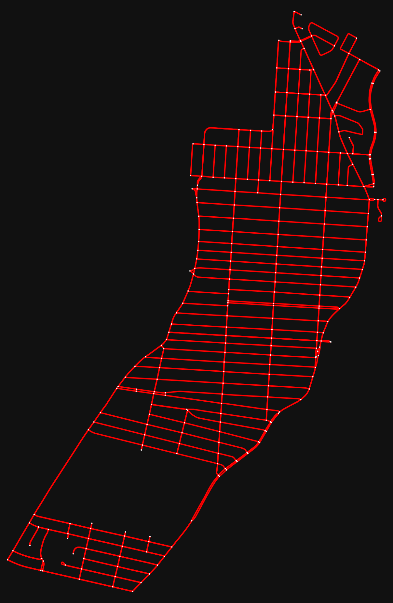

# ERO Project

## Project structure

The project is divided in two main parts. The first one is the drone, and the second one is the snowplow.\
In the `drone` folder, we have all the drone-related computing. The same goes for the `snowplow` folder.\
We organized every utility functions in a `lib` folder and every images and videos used for the `README.md` in the `resources` folder.\
We also have the main program file at the root of the project for easy usage.

## How to install

Make sure you have `Python 3.10.X` or above installed on your computer.\
You will need to install all the necessary dependencies by executing (in the root directory):

```sh
pip install -r requirements.txt
```

If you want to generate videos of routes, you will have to install `ffmpeg`.

## How to run

### Usage

#### Linux

```sh
./snowpath [OPTIONS] COMMAND [ARGS]...
```

#### Windows

```sh
python .\snowpath [OPTIONS] COMMAND [ARGS]...
```

To get the list of the different options and commands available, execute the following command:

```sh
snowpath --help       # --help is optional since it will display the same help page without it
```

### Available options

| Options | Description |
| --- | --- |
| `--delete-data` | Removes saved data. |
| `--help` | Shows the help page and exits. Can be used after any command. |

### Available commands

| Commands | Description |
| --- | --- |
| `display` | Displays districts, routes, and snow data. |
| `drone` | Drone related computing. |
| `snowplow` | Snowplow related computing. |

### The `display` command

| Commands | Description |
| --- | --- |
| `district` | Displays/saves the specified district. |
| `route` | Displays/saves route data. |
| `snow` | Displays/saves snow data. |

#### The `district` subcommand

| Options | Type | Description | Default Value | Required |
| --- | --- | --- | --- | --- |
| `--output` | TEXT | File name to save the district image. | `None` | No |

| Arguments | Type | Description | Default Value | Required |
| --- | --- | --- | --- | --- |
| `name` | TEXT | The district name to display/save. | `None` | Yes |

**Usage**:

```sh
snowpath display district [OPTIONS] NAME
```

#### The `route` subcommand

| Options | Type | Description | Default Value | Required |
| --- | --- | --- | --- | --- |
| `--route-color` | TEXT | The route color. | `red` | No |
| `--road-color` | TEXT | The road color. | `white` | No |
| `--image` | TEXT | The output file to save the route image. | `None` | No |
| `--video` | TEXT | The output file to save the route video. | `None` | No |
| `--nb-threads` | INTEGER | The number of threads to use for the video. | `1` | No |
| `--img-per-sec` | INTEGER | The number of images per second for the video. | `16` | No |

| Arguments | Type | Description | Default Value | Required |
| --- | --- | --- | --- | --- |
| `route_id` | INTEGER | The route id to display/save. | `None` | Yes |

**Usage**:

```sh
snowpath display route [OPTIONS] ROUTE_ID
```

#### The `snow` subcommand

| Options | Type | Description | Default Value | Required |
| --- | --- | --- | --- | --- |
| `--snow-color` | TEXT | The road color when there is snow. | `cyan` | No |
| `--road-color` | TEXT | The road color when there is not snow. | `white` | No |
| `--output` | TEXT | The output file to save the snow data. | `None` | No |

| Arguments | Type | Description | Default Value | Required |
| --- | --- | --- | --- | --- |
| `snow_id` | INTEGER | The snow id to display/save. The id must exist in the database, meaning you have to run the drone first. | `None` | Yes |

**Usage**:

```sh
snowpath display snow [OPTIONS] SNOW_ID
```

### The `drone` command

| Options | Type | Description | Default Value | Required |
| --- | --- | --- | --- | --- |
| `--min-snow` | FLOAT | The minimum snow level to consider. | `0` | No |
| `--max-snow` | FLOAT | The maximum snow level to consider. | `15` | No |
| `--drone-speed` | INTEGER | The maximum speed the drone has, in km/h. | `60` | No |

| Arguments | Type | Description | Default Value | Required |
| --- | --- | --- | --- | --- |
| `district_name` | TEXT | The district/city to analyze. | `None` | Yes |

**Usage**:

```sh
snowpath drone [OPTIONS] DISTRICT_NAME
```

### The `snowplow` command

| Options | Type | Description | Default Value | Required |
| --- | --- | --- | --- | --- |
| `--method` | TEXT | The method to use to clear the snow. Either `eul` or `path`. | `eul` | No |

| Arguments | Type | Description | Default Value | Required |
| --- | --- | --- | --- | --- |
| `snow_id` | INTEGER | The id of the snow data generated by the drone. | `None` | Yes |

**Usage**:

```sh
snowpath snowplow [OPTIONS] SNOW_ID
```

## Examples

Displays Verdun in Montreal in a matplotlib window.

```sh
snowpath display district "Verdun, Montreal"
```


We can now run the drone analysis on Verdun. It will generate snow and route data with both ids at `0`.

```sh
snowpath drone "Verdun, Montreal"
```

The above command will result in this table:

| District | Distance | Speed | Time | Cost |
| --- | --- | --- | --- | --- |
| Verdun, Montreal | 81294.16m | 60km/h | 1.35h | 100.81€ |

Now let's make a video of the route the drone took using the following command:\
**WARNING: Make sure you have `ffmpeg` installed before trying to create a video.**\
**If you are on Windows, this will most likely not work due to a bug related to virtual environments on some IDEs.**

```sh
snowpath display route 0 --video verdun.mp4
```


We can also generate an image of the drone path using:

```sh
snowpath display route 0 --image route.png
```



We can now use the snowplows to remove all the snow analyzed by the drone. It will generate a new route data with id `1` corresponding to the snowplow path:

```sh
snowpath snowplow 0
```

This command will output the following table for the type-1 snowplow:

| Distance | Speed | Time | Distance related Cost | Time related Cost | Total Cost |
| --- | --- | --- | --- | --- | --- |
| | | | | | |

And this table for the type-2 snowplow:

| Distance | Speed | Time | Distance related Cost | Time related Cost | Total Cost |
| --- | --- | --- | --- | --- | --- |
| | | | | | |

We can once again generate a video or an image to visualize the path of the snowplow.\
You can play with the options as much as you want, there are a lot of possibilities.

## Authors

- Mathéo Crespel
- Léo Sambrook
- Briac Guellec
- Inès Metiba
- Augustin Claude

From EPITA Rennes - 2026 school year
